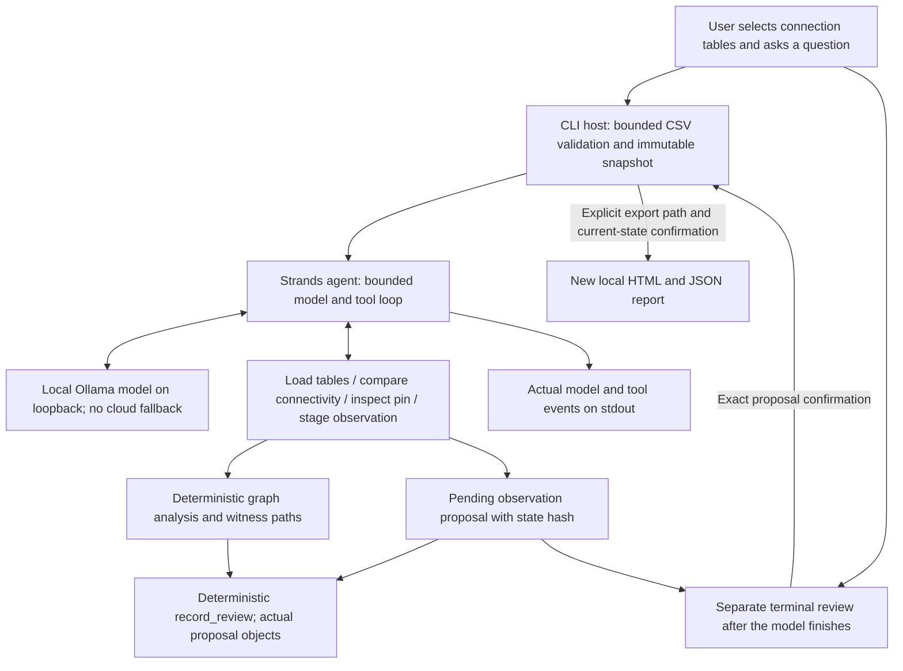

# NetCheck architecture

NetCheck compares an intended pin-to-net table with a user's recorded wire table. Its results describe those records, not an energized physical circuit. Partial observations stay unverified.

The model has no shell, arbitrary network, filesystem, confirmation, or export tool. File selection and report writing belong to the host. Unknown endpoints and invalid CSV records fail validation. Changes remain proposals until the separate host review confirms the exact proposal against the current snapshot.

The runtime uses a local Ollama endpoint at `127.0.0.1:11435`. Model/provider failures and incomplete tool workflows terminate with a nonzero status. The host validates tables before inference. A response without an actual comparison or proposal tool is not accepted as a completed run. Proposal tools include current connectivity analysis, so they do not depend on the model requesting redundant load/compare calls first.

Core tests and model evaluation are different evidence. The deterministic core passed its recorded tests; consult actual model traces for the status of a particular model/configuration. This document explains the implemented component boundaries and does not certify model accuracy or hackathon registration.

Model text is an unverified draft: real trials exposed incorrect explanations and an unsupported action claim. Final record facts are computed independently from the current snapshot and actual proposals; exported reports contain no model prose. The model has separate add and remove tools so removal cannot require invented endpoints. A proposal made against an older snapshot is skipped during host review and cannot interrupt export of an already confirmed change.
